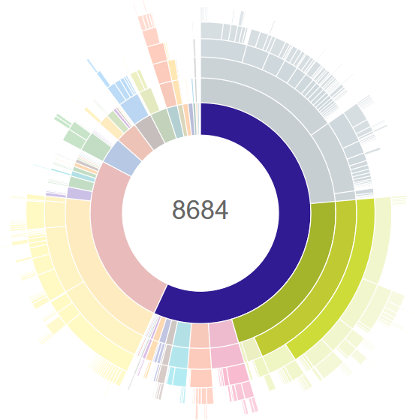

<h1 align="center">
	<p>Dexcount Gradle Plugin</p>
    
</h1>

[](https://travis-ci.org/KeepSafe/dexcount-gradle-plugin)
[](http://androidweekly.net/issues/issue-174)
[](http://android-arsenal.com/details/1/1940)
[](https://gitter.im/keepsafe/dexcount-gradle-plugin?utm_source=badge&utm_medium=badge&utm_campaign=pr-badge&utm_content=badge)

A Gradle plugin to report the number of method references in your APK or AAR on every build.

This helps you keep tabs on the growth of your app, with an eye to staying under the 65,536 method-reference limit, and avoiding the headache of eliminating methods or enabling multidex.

## Usage

in `app/build.gradle`
```groovy
buildscript {
    repositories {
        mavenCentral() // or jcenter()
    }

    dependencies {
        classpath 'com.getkeepsafe.dexcount:dexcount-gradle-plugin:0.8.2'
    }
}

// make sure this line comes *after* you apply the Android plugin
apply plugin: 'com.getkeepsafe.dexcount'
```

#### Note
`dexcount-gradle-plugin` "requires" Java 8 to run.  "Requires" means that, while it will technically work if Gradle is being run on Java 7, there are situations where it may crash.  This is caused by dependencies we don't bundle targeting JRE 8; these cannot be loaded on older runtimes.  Attempting to load them will crash Gradle.  This currently applies only to counting `.aar` library projects, but as time goes by the JRE-8-only surface area will only increase.

Android build tools versons 3.0.0-alpha1 through 3.0.0-beta5 are not supported by `dexcount-gradle-plugin`; their APIs are incompatible.  Newer and older versions work without issue.

## Sample output

```
> ./gradlew assembleDebug

...buildspam...
:app:compileDebugSources
:app:preDexDebug UP-TO-DATE
:app:dexDebug
:app:packageDebug
:app:zipalignDebug
:app:assembleDebug
Total methods in MyApp-debug.apk: 58930 (89.92% used)
Total fields in MyApp-debug.apk:  27507 (41.97% used)
Methods remaining in MyApp-debug.apk: 6605
Fields remaining in MyApp-debug.apk:  38028


BUILD SUCCESSFUL

Total time: 33.017 secs
```

## Detailed method counts

By default, a breakdown of method references by package and class will be written to a file under `${buildDir}/outputs/dexcount/${variant}`.

For example, an excerpt from our own app (in `app/build/outputs/dexcount/debug.txt`):
```
methods  fields   package/class name
5037     1103     android.support.v4
29       1        android.support.v4.accessibilityservice
57       16       android.support.v4.animation
931      405      android.support.v4.app
87       31       android.support.v4.content
139      12       android.support.v4.graphics
116      11       android.support.v4.graphics.drawable
74       9        android.support.v4.internal
74       9        android.support.v4.internal.view
194      35       android.support.v4.media
11       0        android.support.v4.media.routing
156      26       android.support.v4.media.session
```

## Configuration

Dexcount is configurable via a Gradle extension (shown with default values):

in `app/build.gradle`:
```groovy
dexcount {
    format = "list"
    includeClasses = false
    includeClassCount = false
    includeFieldCount = true
    includeTotalMethodCount = false
    orderByMethodCount = false
    verbose = false
    maxTreeDepth = Integer.MAX_VALUE
    teamCityIntegration = false
    teamCitySlug = null
    runOnEachPackage = true
    maxMethodCount = 64000
}
```

Each flag controls some aspect of the printed output:
- `format`: The format of the method count output, either "list", "tree", "json", or "yaml".
- `includeClasses`: When true, individual classes will be include in the package list - otherwise, only packages are included.
- `includeClassCount`: When true, the number of classes in a package will be included in the printed output.
- `includeFieldCount`: When true, the number of fields in a package or class will be included in the printed output.
- `includeTotalMethodCount`: When true, the total number of methods in the application will be included in the printed output.
- `orderByMethodCount`: When true, packages will be sorted in descending order by the number of methods they contain.
- `verbose`: When true, the output file will also be printed to the build's standard output.
- `maxTreeDepth`: Sets the max number of package segments in the output - i.e. when set to 2, counts stop at `com.google`, when set to 3 you get `com.google.android`, etc.  "Unlimited" by default.
- `teamCityIntegration`: When true, Team City integration strings will be printed.
- `teamCitySlug`: A string which, if specified, will be added to TeamCity stat names.  Null by default.
- `runOnEachPackage`: When false, does not run count method during package task. True by default.  Synonym for `runOnEachAssemble`, which is deprecated.
- `maxMethodCount`: When set, the build will fail when the APK/AAR has more methods than the max. 0 by default.

## Use with Jenkins Plot Plugin

A common use-case is to plot method and field counts across builds.  The [Jenkins Plot plugin][0] is a general-purpose tool that graphs per-build scalar values through time.  It reads java .properties files, CSV files, and XML files.  Dexcount generates two files for each variant - a full package list, and a summary CSV file.  The summary file is usable as-is with the Jenkins Plot Plugin.  You can find it in `app/build/outputs/variant.csv` (note the `.csv` extension).

Consult the plugin documentation for details on how to configure it.

## Use with Team City

Common case is to enable integration with `teamCityIntegration` option and add custom statistic graphs in Team City. Key name is generated by pattern `DexCount_${variant}_ClassCount`, `DexCount_${variant}_MethodCount` and `DexCount_${variant}_FieldCount`

_Technically special strings like_ `##teamcity[buildStatisticValue key='DexCount_universalDebug_MethodCount' value='62362']` _will be printed._ 

[More about integration in Team City doc][1]

If you have multiple products within one project using Dexcount, the default stat names will conflict with each other.  In this case, the `teamCitySlug` configuration option can be useful.  It is a string that, if specified, will be added to stat names according to the following scheme: `DexCount_${teamCitySlug}_${variant}_${statName}`.  Note that you can assign a dynamically-evaluated property, e.g. `teamCitySlug = project.name`.

## Note on Instant Run

`dexcount-gradle-plugin` does not count methods for Instant Run builds in Android Studio.  Instant Run is implemented in such a way that it makes method counts very inaccurate.  As of build-tools version 3.0.0, it is no longer possible to access the complete incrementally-built APK at all.  For these reasons, **Instant Run is not supported**.

## Snapshot Builds

We host snapshots in the Sonatype OSS repo.  They are updated on each commit.  As snapshots, they are inherently unstable - use at your own risk!  To use them, add the Sonatype Snapshot repo to your repositories:

```groovy
buildscript {
  repositories {
    // other repos should come first
    maven { url 'https://oss.sonatype.org/content/repositories/snapshots' }
  }

  dependencies {
    classpath 'com.getkeepsafe.dexcount:dexcount-gradle-plugin:0.8.3-SNAPSHOT'
  }
}
```


## Building

`./gradlew build`

Pushing artifacts to Sonatype requires membership in the KeepSafe Sonatype org, which is by employment only.  Once
you have a login, put it in your private global Gradle file (e.g. `~/.gradle/gradle.properties`, along with a valid
GPG signing configuration.

## Minutia

This plugin creates a task per output, per variant, and configures each task to run after that variant's `package` task.  This means that if the `package` task does not run, no method count will be reported.  This also means that counts are done after Proguard is run, if minification is enabled.  Dexcount will use the resulting mapping file to de-obfuscate class and package names.

## Credits

The Java code from the `com.android.dexdeps` package is sourced from the [Android source tree](https://android.googlesource.com/platform/dalvik.git/+/master/tools/dexdeps/).
Inspired by Mihail Parparita's [`dex-method-counts`](https://github.com/mihaip/dex-method-counts) project, to whom much credit is due.

Copyright 2015-2017 Keepsafe Software, Inc

[0]: https://wiki.jenkins-ci.org/display/JENKINS/Plot+Plugin
[1]: https://confluence.jetbrains.com/display/TCD9/Build+Script+Interaction+with+TeamCity#BuildScriptInteractionwithTeamCity-ReportingBuildStatistics
