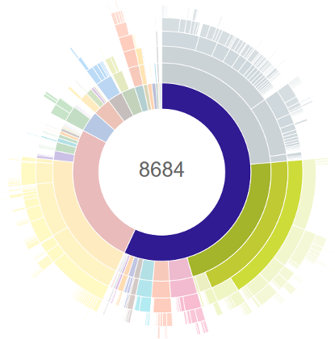

<h1 align="center">
	<p>Dexcount Gradle Plugin</p>
    
</h1>


A Gradle plugin to report the number of method references in your APK, AAR, or java module on every build.

This helps you keep tabs on the growth of your app, with an eye to staying under the 65,536 method-reference limit, and avoiding the headache of eliminating methods or enabling multidex.

## Usage

### Installation

```groovy
plugins {
    // make sure to apply an Android plugin *before* dexcount
    id "com.getkeepsafe.dexcount"
}
```

Or, if you prefer the legacy "apply plugin" syntax:

```groovy
// in build.gradle
buildscript {
    repositories {
        mavenCentral()
    }

    dependencies {
        classpath 'com.getkeepsafe.dexcount:dexcount-gradle-plugin:3.1.0'
    }
}

// in app/build.gradle
// make sure this line comes *after* you apply the Android plugin
apply plugin: 'com.getkeepsafe.dexcount'
```

### Execution

When applied, `dexcount-gradle-plugin` will create one task per Android variant that you can execute to produce method-count reports.  The tasks are named according the variant, in the format "count${variant}DexMethods".  In a typical app, that means there will be tasks named `countDebugDexMethods` and `countReleaseDexMethods`.

Historically, these counting tasks were run by default on every build; this continues to be true for projects using versions of Android Gradle Plugin from 3.4.0 up until 4.1.0.  Beginning with 4.1.0, this is no longer the case, and method counts must be manually requested.

Here's how to build and count an APK:

```bash
# Build an APK and count its method references
./gradlew :app:countDebugDexMethods

# Build an AAR and produce an approximate method count
./gradlew :lib:countDebugDexMethods

# Build an App Bundle (.aab) and count its method references
# (requires AGP 4.1.0 and above)
./gradlew :app:countDebugBundleDexMethods
```

## Sample output

```
> ./gradlew assembleDebug

...buildspam...
:app:compileDebugSources
:app:preDexDebug UP-TO-DATE
:app:dexDebug
:app:packageDebug
:app:zipalignDebug
:app:assembleDebug
Total methods in MyApp-debug.apk: 58930 (89.92% used)
Total fields in MyApp-debug.apk:  27507 (41.97% used)
Methods remaining in MyApp-debug.apk: 6605
Fields remaining in MyApp-debug.apk:  38028


BUILD SUCCESSFUL

Total time: 33.017 secs
```

## Detailed method counts

By default, a breakdown of method references by package and class will be written to a file under `${buildDir}/outputs/dexcount/${variant}/`.

For example, an excerpt from our own app (in `app/build/outputs/dexcount/debug/debug.txt`):
```
methods  fields   package/class name
5037     1103     android.support.v4
29       1        android.support.v4.accessibilityservice
57       16       android.support.v4.animation
931      405      android.support.v4.app
87       31       android.support.v4.content
139      12       android.support.v4.graphics
116      11       android.support.v4.graphics.drawable
74       9        android.support.v4.internal
74       9        android.support.v4.internal.view
194      35       android.support.v4.media
11       0        android.support.v4.media.routing
156      26       android.support.v4.media.session
```

## Snapshot Builds

We host snapshots in the Sonatype OSS repo.  They are updated on each commit.  As snapshots, they are inherently unstable - use at your own risk!  To use them, add the Sonatype Snapshot repo to your repositories:

```groovy
buildscript {
  repositories {
    // other repos should come first
    maven { url 'https://oss.sonatype.org/content/repositories/snapshots' }
  }

  dependencies {
    classpath 'com.getkeepsafe.dexcount:dexcount-gradle-plugin:3.1.1-SNAPSHOT'
  }
}
```
